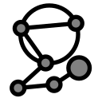
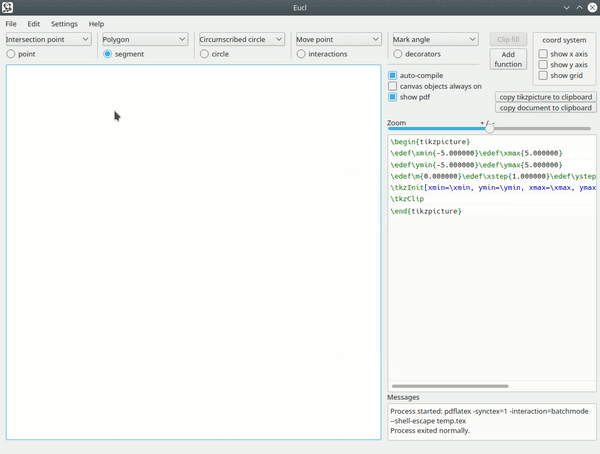

# TkzGeom

*This is a rewrite of the original software from the ground up. It is in early stages of development, hence expect missing features and bugs. You find the working original version in the branch named "old_version".*

*The reason of the rewriting is to redesign the program in OOP style, reducing the repetitive codebase and allowing for easier future scalability. Having developed the original program gives the best insight for engineering/design improvement possibilities in this new version.*

*Planned additional features:*
- *native support for a wide range of commutative diagrams*
- *anti-aliased canvas items*
- *tikz double line*
- *adding user-defined RGB based colours, improved colour management*
- *continuous keypress to enable move point feature and move canvas feature*
- *the properties dialog embedded in the main window, as well as more intuitively grouped widgets*
- *all items have unique ID/name, that can be modified for easier navigation*
- *in QlistWidget, multiple items can be selected and edited simultaneously*
- *toolTip to be added to most widgets*
- *titlebar including project status*
- *other optimisations/beautifications*

>*Under **Windows** OS Alt press moves points*, *CTRL press moves the canvas.*

>*Under **Linux** OS AltGr press moves points*, *CTRL press moves the canvas.*

> *README will be updated when most objectives are met.*

**Binaries:**

- old version for Windows 10

https://mega.nz/file/58cHAQJJ#ViVTsIa1EE4nqlMXZhILufJB4re2-jTaOdPdLnbHbJU

- new version (incomplete) for Window 10

https://mega.nz/file/AgdDzSAK#jkwmAbc_CtISYdXjymspLg0GcvkljpCuoTwbWrEcpnE

**TkzGeom** is a GUI tool to create publication quality figures in *.tex* or *.pdf* format. It aids and speeds up the production of a wide range of tikz images.

# Contents
<!-- TOC depthFrom:1 depthTo:6 withLinks:1 updateOnSave:1 orderedList:0 -->

- [TkzGeom](#tkzgeom)
- [Contents](#contents)
- [Demos](#demos)
	- [Example of editing an existing project](#example-of-editing-an-existing-project)
	- [Animated video using a saved session from TkzGeom](#animated-video-using-a-saved-session-from-tkzgeom)
- [Requirements](#requirements)
- [Usage](#usage)
- [Features](#features)
- [Shortcuts](#shortcuts)
- [Object explanation](#object-explanation)
	- [Point](#point)
	- [Segment](#segment)
	- [Circle](#circle)
	- [Interactions](#interactions)
	- [Decorators](#decorators)
- [Limitations](#limitations)

<!-- /TOC -->

# Demos

## Example of editing an existing project

## Animated video using a saved session from TkzGeom

> Note that these demos are reduced in size and frame rate.

# Requirements

- TexLive 2019 or newer or MiKTeX 2019 or newer (have not tested MiKTeX but should work in principle), the program runs without it as long as auto-compile is turned off, and the project is never compiled but it results in user experience without visual feedback.
- A PDF to JPG converter, the default converter is `pdftocairo`, which is part of TexLive. This can be configured in the settings menu.
- `Gnuplot`, this is needed only when functions are in the figure.
- Libraries for Python can be installed using `pip install -r requirements.txt`. Note that here `Pygments` is not needed, only if the user wants to try other syntax highlighting than the built in.

# Usage

1. Run the `Makefile` by running make in the root folder of the program.
2. From the radio button at the top of the screen choose the object type you would like to draw.
3. In the corresponding droplist select the item to be added. Functions can be added on the separate click button.
4. Click on the canvas or on existing objects.
5. Once the object exists, "Right Click" the canvas and fine tune the appearance of the objects.
6. Move the free points on the canvas or the canvas itself by choosing the "interactions" radio button. Zoom the canvas in/out using the slider on the right hand side.

# Features

1. instantly generated TikZ code,
2. move free points on the canvas,
3. auto compilation into PDF for visual feedback,
4. additional packages and libraries can be added,
5. additional tikz code can be added after the generated code, so unimplemented features can be used on the user defined points, e.g. this can be used to define electric circuits with ease,
6. additional code can be added before the image, this is useful e.g. for `\newcommand`s,
7. perfect tool for visualising figures in Euclidean geometry,
8. projects can be saved, and loaded in the popular JSON extension, loading such file in a programming language with `openCV` can create animated videos.

> Basic knowledge of tikz helps making the most out of this software.

# Shortcuts

|Key             |Shortcut of                         |
|----------------|------------------------------------|
|CTRL+Z          |undo                                |
|CTRL+SHIFT+Z    |redo                                |
|Delete          |delete object in the properties menu|
|F5              |compile the current version of edit |
|CTRL+O          |open existing project               |
|CTRL+S          |save current project                |
|CTRL+SHIFT+S    |save as                             |
|CTRL+N          |create new project                  |

# Object explanation
## Point
**point**: click <ins>anywhere</ins> on the canvas;
defines a point at any coordinate,

**point on line**: click <ins>segment</ins> or <ins>two points</ins> then enter ratio in a popup window;
defines a point on a segment dividing it with a given ratio (can be any real number)

**point on circle**: click <ins>circle, then enter angle</ins> (in degrees) in a popup window;
defines a point on a circle at specified angle to the abscissa

**intersection**: click <ins>four points</ins> (endpoints of segment 1 then endpoints of segment 2), or click <ins>two segments</ins>, or click <ins>a circle and a segment</ins>, or click <ins>a segment and a circle</ins>, or <ins>two points and a circle</ins>;
defines the intersection of two lines, or a line and a circle, (in the latter case, two intersection points are possible), (circle-circle intersection is not yet implemented)

**midpoint of segment**: click <ins>two points</ins> or a <ins>segment</ins>;
defines the middle points of a segment

**midpoint of circle**: click <ins>circle</ins>;
defines the middle of a circle

**orthogonal projection**: click <ins>three points</ins>, or <ins>a segment and a point</ins>, or <ins>a point and a segment</ins> (the first two points define the segment, the last point to point to be projected);
defines the orthogonal projection of a point onto a line

**bisector**: click <ins>three points</ins> (at the second point is the angle, the direction of angle matters);
defines a point on the bisector of an angle

**translate with vector**: click <ins>three points</ins>:
defines a new point from old after translation by vector

**perpendicular**: click <ins>two points</ins>;
defines a point on the perpendicular to the segment at the first point

**rotation**: click <ins>two points and angle in degrees</ins> in a popup window;
defines a point on rotated by a given angle around another point

**make grid**: click <ins>three points and rows and columns</ins> in a popup window (these points will span the grid);
defines the lattice of points generated by the three selected points (movement of the three points results in the entire lattice move)

## Segment

**segment**: click <ins>two points</ins>;
defines a segment connecting the two points

**polygon**: click <ins>the vertices of the polygon and click the first vertex again</ins> to conclude selection;
defines a polygon object

**linestring**: click <ins>the vertices of the linestring and the last vertex again</ins> to conclude;
defines a linestring object

## Circle

**circumscribed circle**: click <ins>three points</ins>;
defines the circumscribed circle around three points

**circle by its radius**: click <ins>two points</ins>;
defines a circle with first point as centre, the second point as a point on the perimeter

**arc**: click <ins>three points</ins>;
defines an arc with first point as center, the other two defining the radius and range

**sector**: click <ins>three points</ins>;
defines a sector with first point as center, the other two defining the radius and range

**inscribed circle**: click <ins>three points</ins>;
defines the inscribed circle around three points
## Interactions
**move point**: drag free points the change their positions

**move canvas**: drag canvas to a new position
## Decorators
**mark angle**: click <ins>three points</ins>;
defines an arc to show the presence of an angle

**mark right angle**: click <ins>three points</ins>;
defines an arc to show the presence of a right angle

# Limitations

A select of features are included as part of the GUI, enough to cover most everyday situations, but does not aim to be comprehensive. To mitigate this issue, there is an option to add any code after the automatically generated code, and also to add other LaTeX packages/libraries.
The draw order of objects is predetermined, there is no built in way to change this. (e.g. segments are always drawn above polygons.)
